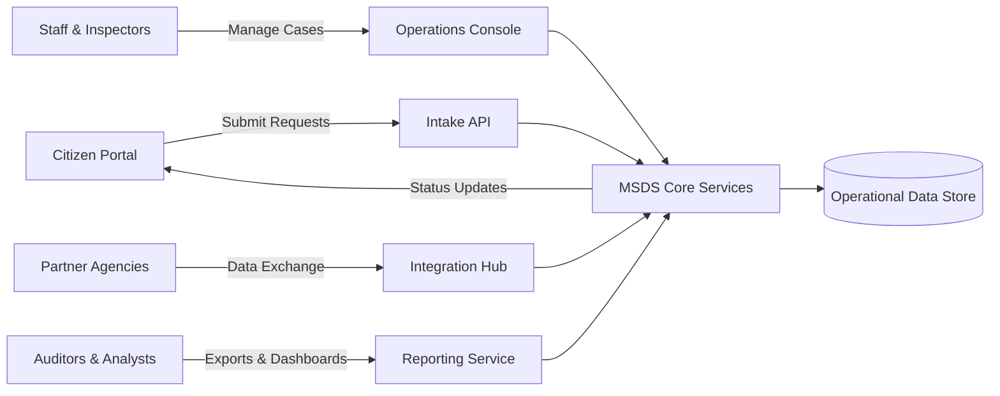
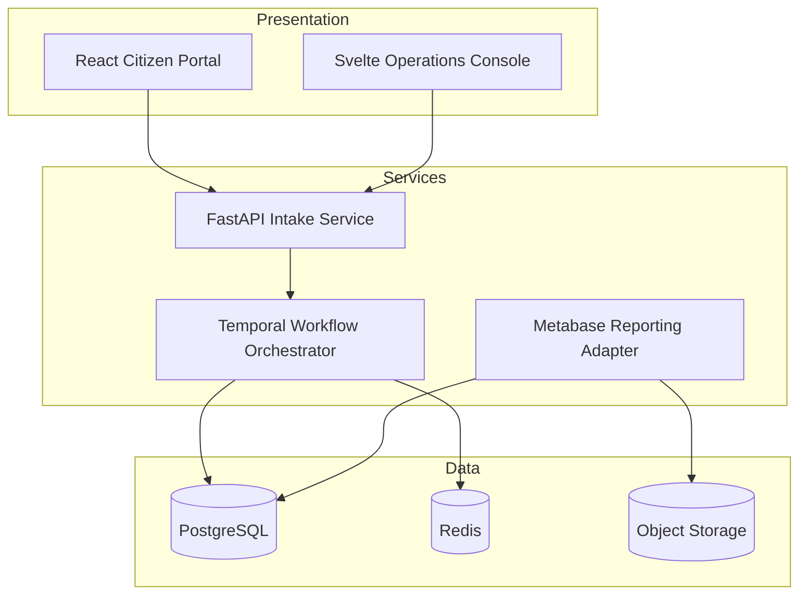
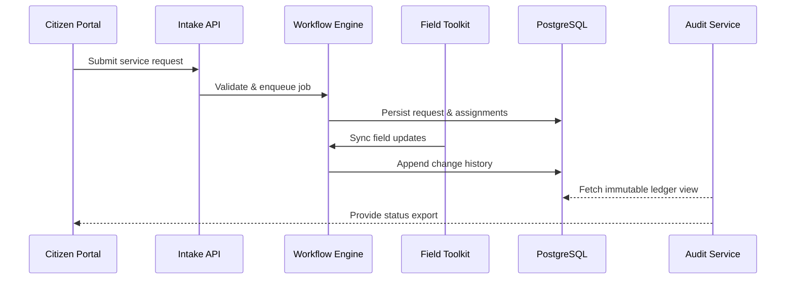

# MSDS Platform

MSDS (Municipal Services Data System) is a blueprint for a modular platform that centralizes
service requests, inspections, and compliance data for municipal agencies. The project focuses on
streamlining staff workflows, providing clear data lineage, and exposing reporting interfaces for
internal auditors and external stakeholders.

## Table of Contents
- [Project Overview](#project-overview)
- [System Goals](#system-goals)
- [Setup Instructions](#setup-instructions)
- [High-Level Architecture](#high-level-architecture)
  - [Context Diagram](#context-diagram)
  - [Logical Component Diagram](#logical-component-diagram)
  - [Data Lifecycle](#data-lifecycle)
- [Documentation Index](#documentation-index)
- [Contributing](#contributing)
- [License](#license)

## Project Overview
MSDS aggregates structured and unstructured data from intake channels (web, phone, and field
collections), enriches the information through validation pipelines, and stores the results in a
centralized relational database. Core services include:

- **Intake API** for capturing new service requests from public-facing portals.
- **Operations Console** for municipal staff to triage, assign, and update requests.
- **Field Toolkit** supporting inspectors with offline sync and geospatial overlays.
- **Reporting & Audit Service** providing scheduled exports and ad hoc dashboards.

## System Goals
1. Provide a single source of truth for service request lifecycle data.
2. Reduce manual data handling through automation, validation, and deduplication.
3. Support compliance requirements with auditable change history and exportable records.
4. Offer deployment flexibility across local developer machines, on-premise VPS, and hosted
   environments such as Replit.

## Setup Instructions
Although this repository currently captures architecture and process documentation, the following
steps prepare a development environment for the reference implementation described in the docs:

1. **Clone the repository**
   ```bash
   git clone https://github.com/your-org/msds.git
   cd msds
   ```
2. **Install system prerequisites**
   - Python 3.11+
   - Node.js 18+ (for the staff console front end)
   - PostgreSQL 15+
   - Redis 7+ (optional, used for task queues and caching)
3. **Create and activate a Python virtual environment**
   ```bash
   python -m venv .venv
   source .venv/bin/activate
   ```
4. **Install backend dependencies**
   ```bash
   pip install -r backend/requirements.txt
   ```
5. **Install front-end dependencies**
   ```bash
   cd frontend
   npm install
   cd ..
   ```
6. **Provision a local `.env` file** using the example provided in `config/.env.example`, then run
   database migrations and seed data once application code is available.
7. **Run the development stack** using the orchestration tool of your choice:
   ```bash
   docker compose up --build
   ```

Consult the dedicated deployment guides in `docs/deployment/` for environment-specific notes,
including VPS hardening and Replit-specific configuration.

## High-Level Architecture
The MSDS platform follows a service-oriented architecture that separates intake, workflow
orchestration, and reporting concerns. The diagrams below provide a high-level view.

### Context Diagram


### Logical Component Diagram


### Data Lifecycle


## Documentation Index
| Topic | Location |
|-------|----------|
| Blueprint & delivery roadmap | [`docs/blueprint-roadmap.md`](docs/blueprint-roadmap.md) |
| Acceptance test catalogue | [`docs/acceptance-tests.md`](docs/acceptance-tests.md) |
| MSDS data field mapping | [`docs/msds-field-mapping.md`](docs/msds-field-mapping.md) |
| Deployment guides (local, VPS, Replit) | [`docs/deployment/`](docs/deployment/) |
| Usage examples & operational runbooks | [`docs/usage-examples.md`](docs/usage-examples.md) |

## Contributing
1. Fork the repository and create feature branches from `main`.
2. Write clear commit messages and keep pull requests scoped.
3. Update documentation and tests alongside any code changes.
4. Run acceptance tests documented in `docs/acceptance-tests.md` before opening a PR.

## License
This project is released under the [MIT License](LICENSE).
